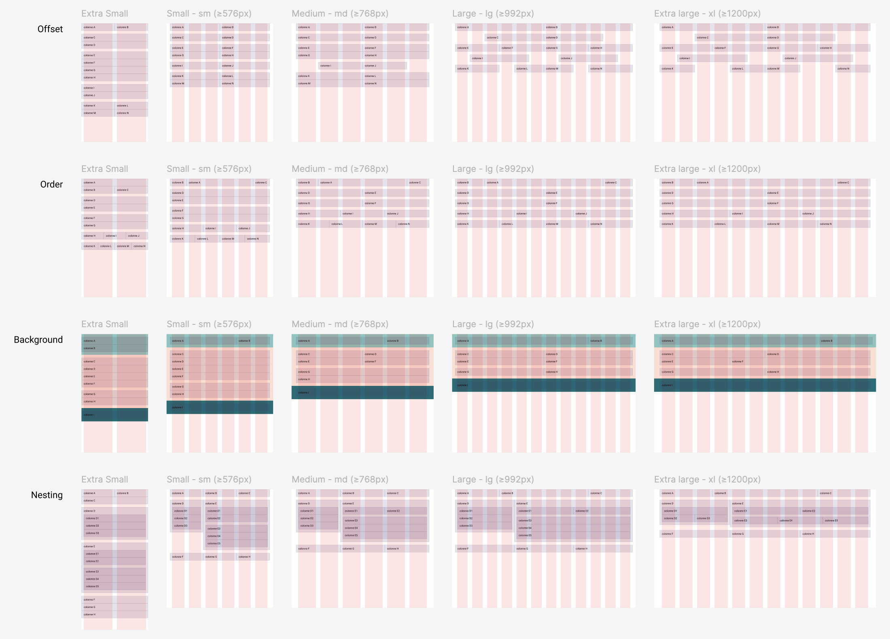

# Exercice Bootstrap 6

## Installation

1. Cloner le repository
2. Ouvrir le dossier avec Visual Studio Code
3. Ouvrir une fenêtre de terminal dans Visual Studio Code et entrer la commande suivante :

```bash
npm install
```

3. Installer Bootstrap en suivant [la documentation sur Notion](https://eikon-imd.notion.site/Bootstrap-Installation-dans-le-starterkit-3f58413c9b5c4143b7ab83c5e51d69c2)

4. Pour rendre la grille visible, ajouter la CSS comme indiqué dans [la documentation sur Notion](https://eikon-imd.notion.site/Bootstrap-layout-highlighter-e3813cee0d694df497faced10f2cc49c)

## Travail

Depuis le terminal, entrer la commande suivante :

```bash
npm run dev
```

## Consigne

Intégrez [la maquette Figma](https://www.figma.com/design/jbvshdtUNSvrLNMbWkbGVp/imd2-exercice-bootstrap-6?node-id=0-1&t=YiPyHR59d925VyYv-1) en utilisant la grille Bootstrap.

☝️ Pour chaque étape, il y a [une documentation sur Notion](https://eikon-imd.notion.site/Bootstrap-8efc8d462ef7476c8b54bf78f15f3a48).

☝️ Commencez par la version mobile, puis ajoutez les modifications pour chaque breakpoint.

☝️ Vous n'avez pas besoin de modifier la CSS. Ajoutez uniquement du HTML.

☝️ Pensez à afficher la grille sur Figma, afin de voir la largeur des colonnes.

## Aperçu


